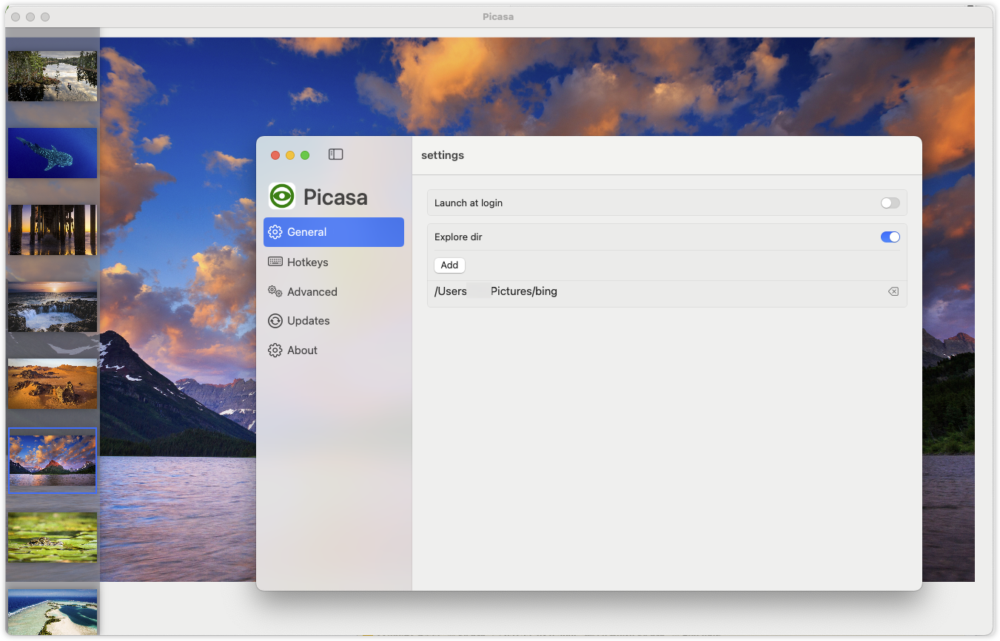

# Picasa

An image Viewer for macOS power by SwiftUI .

## Features
- [x] View images using open with 
- [x] scan directory which selected image in
- [x] zoom in and zoom out image use Mouse Wheel
- [ ] view image toolbar
- [ ] shortcut key settings

## Download

You can download the latest release from the [releases page](https://github.com/wflixu/Picasa/releases).

## Preview

A Screenshot of the app:

## license

MIT
